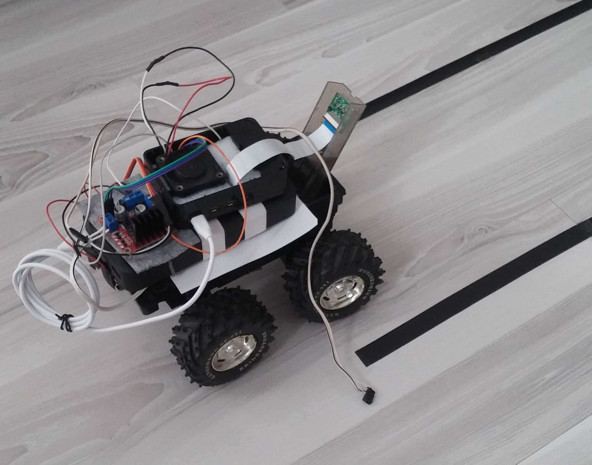

# Şerit Takip Sistemi
Bu proje, bir aracı belirli bir şeritte tutmak için kameradan gelen görüntüleri OpenCV kütüphanesi ile işleyerek şeridi takip etmesini sağlamayı amaçlar.

Projenin orijinal versiyonunu 2020 yılında sıfırdan Python öğrenerek geliştirdim. Ancak, kodu daha okunaklı hale getirmek, açıklamalar eklemek ve genel düzeni iyileştirmek amacıyla projeyi güncelledim. Böylece, kod daha anlaşılır ve yeni başlayan geliştiriciler için öğretici bir hale geldi.

 <a href="https://www.youtube.com/watch?v=kRQ0gB8dv0I" target="_blank" rel="noopener" style="font-size: 60px; text-decoration: none; color: #000;">Şerit Takip Sistemi - Python & OpenCV ile Görüntü İşleme</a>

## Araç

